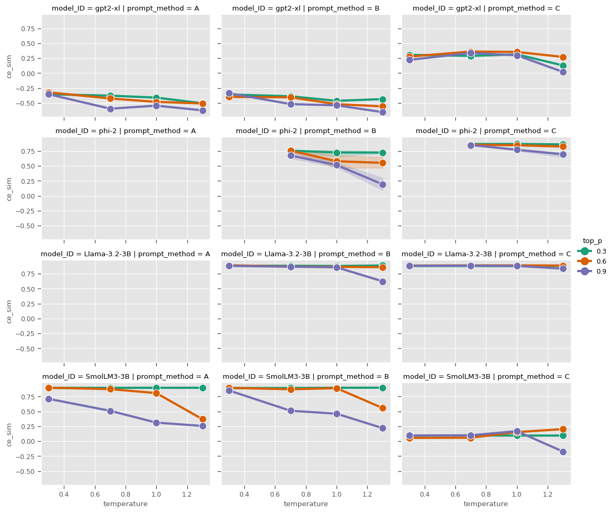
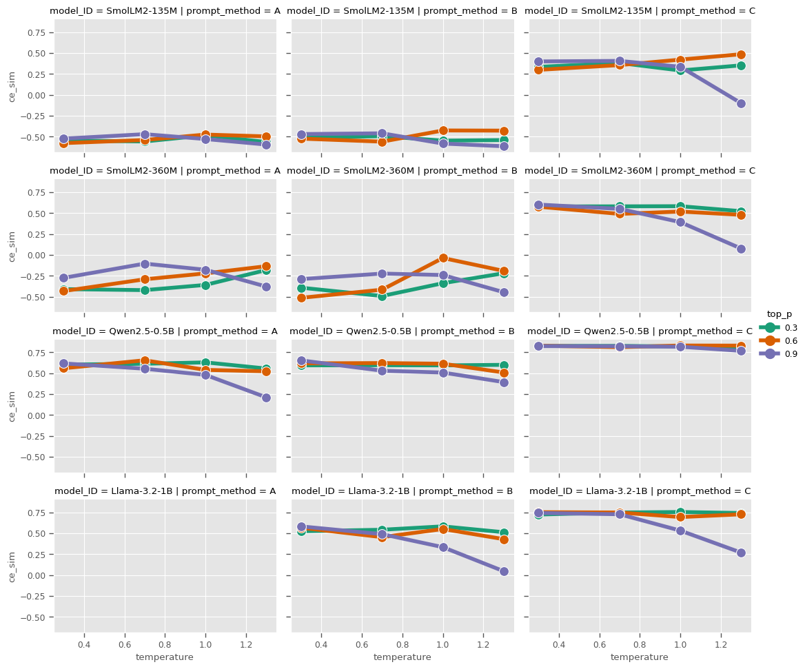

# AI Reporting Agent - Summary
This project focused on creating an NLP agent capable of generating clear and structured incident reports from minimal inputs, based on the 5W1H framework. Lacking public datasets, the authors generated over 200 synthetic cases covering pharmaceutical deviations and traffic accidents. Several open-source LLMs, ranging from 135M to 3B parameters, were tested with different prompting strategies and similarity metrics. Results showed that Qwen2.5-0.5B was the most reliable small model, while Llama-3.2-3B-Instruct achieved the highest performance, with similarity scores around 0.93. Domain-specific prompting further enhanced output quality, proving the importance of tailored input strategies.

To reduce resource demands, the team fine-tuned SmolLM2-360M-Instruct on 800 synthetic traffic accident cases using Supervised Fine-Tuning with QLoRA and PEFT. This improved performance to \~0.88, nearly matching larger 3B models while being ten times smaller and far more efficient. Training on larger datasets or applying knowledge distillation did not lead to additional improvements, as the task was too deterministic to benefit from teacher models. The study concludes that for top accuracy, Llama-3.2-3B is the best option, but specialized lightweight models like SmolLM2-360M provide an excellent trade-off between performance and efficiency, making them highly suitable for practical deployment.  

**NB:** The report with the results and conclusions can be found in the repo folder 'docs/`.

# Abstract

In many industries, as part of a highly performing Quality Assurance and Customer Support functions, reporting unusual events, anomalies, or process deviations requires clear, structured documentation that captures the full context: what happened, when, where, who was involved, why it occurred, and what actions were taken… This project proposes the development of a chatbot assistant that interacts with the user to collect all relevant information through a series of structured questions. The assistant then automatically generates a well-written, standardized report based on the input. Here some of the tasks carried out:

- Data creation: generate a data set of reports to use them as ground truth (reference) to train the model. This was made by automating prompts through an API.

- Model selection and experimentation plan : Test different Hugging Face models to evaluate its performance. Play with the generation parameters (temperature, top_k, top_p, presence_penalty, etc) and compare the results

- Evaluation metrics : Text-to-text comparison, through tokenization and the attention mechanism: Bert score, bleu/rouge score, jaccard, sentence similarity

- Model training : Fine-tune the parameters of an already-trained tiny model (less than 1 billion parameters) from Hugging face in order to specialize it in the reporting task

# Model selection
Two model sizes were studied for generating one-paragraph reports: 
- Meidum size models (< 3B parameters)
- Small size models (< 1B parameters)

A grid search has been done to select the best generation parameters. Here below you can find the results of the grid search.  

**Medium size models Grid Search**  



**Small size models Grid Search**  



## Best base models
After doing the grid search for several generation paramenters, the best models giving the *highest cross encoder similarity score* were:
-	Best *small size* model (< 1B): **Qwen2.5-0.5B-Instruct**
-	Best *medium size* model (1B < size < 3B): **Llama-3.2-3B-Instruct**

# Evaluation metrics
Several evaluation metrics have been calculated in the grid search:
- **BLEU**: similar to precision on n-grams
- **ROUGE**: similar to recall on n-grams
- **BERTscore**: precision, recall and f1
- **Bi-encoder similarity** (cosine similarity between outputs sequences)
- **Cross-encoder similarity** (best score for evaluating texts with several sentences)

# Training
Withing the SFT framework, two training loss functions are used (see `mods/trainingManager.py` class).:
- A Cross-Entropy only loss function
- A Distilled (KL divergence + cross-entropy) loss function

The results of the training shown that distillation is not appropriate for generating one-paragraph (simple) reports, as they are deterministic and distillation from a teacher does not add any value to it.  

## Improving a base model
We have obtained good results when training a *SmolLM2-360M-Instruct* model.  
An increase of **10%** on the Cross encoder similarity was obtained and **a dramatic reduction of the standard deviation** when comparing to the **base model**.  
The trained model can be downloaded at [DSTI's HuggingFace repo](https://huggingface.co/DSTI/smollm2-accident-reporter-360m-800) and also is included in the streamlit **web app** (`reportingAgent.py`).

# Getting started

## Python version
The python version of this project is **3.11.13**

## Getting the repo
Clone the repository and install the dependencies. Here an example of how to create a python environment with conda.  
If you already have one python 3.11 available, skip the Conda part.

### Create a python environment (Conda)
If you have a Conda installed, use the following commands:
```
conda create -n <name_of_environment> python=3.11 -y
conda activate <name_of_environment>
cd "project_path"
pip install -r requirements.txt
```

### Already have a python 3.11 environment
If you already have a 3.11 python environment
```
cd "project_path"
pip install -r requirements.txt
```

## App execution

To open the app, execute the following command in the root folder.

``` streamlit run app/reportingAgent.py --server.address=0.0.0.0 --server.port=8501 ```

## Environments

In order to make the app work properly, a `.env` file must be created **after** cloning the repo and place it in the root folder `reportingAgent`.  
The `.env` file must contain the following environment variables that are either *API tokens* or a *Hugging Face token*.   
```python
API_GPT_KEY = <my_GPT_token>
API_GROQ_KEY = <my_GROQ_token>
EP_NGROK_TOKEN = <my_NGROQ_token>
API_OPEN_ROUTER_KEY = <my_OPEN_ROUTER_token>
HF_TOKEN = <my_HF_TOKEN>
# NOTA: Create HF token for accessing Llama and Janus
```
**NB:** If the user does not have a certain API token the 'apiReportGenrator.py` may not work when using some of the proposed API services (*Grok, OpenRouter (free)*, *chatGPT (pay)*. In the case of using a Llama or Janus model, the Hugging Face importing may not work without a HF_TOKEN.

## Grid search execution

To call the grid search, you can use the script `reportParamGridSearch.py` found in the `app` folder.
An example for calling it is as follows
```
python app/reportParamGridSearch.py --model_id openai-community/gpt2-xl --non-threaded --prompt_method B C --max_workers 4 --dataset_filename pharma_dev_reports_collection.xlsx --start_idx 1 --end_idx 80  --temperature 0.7 1.0 1.3 --top_p 0.3 0.6 0.9 --top_k 30 50 70 --max_new_tokens 300 --do_sample True
```
Here we specify:
- The model_id: any model id existing in HF
- The prompt method: ```A, B, C or D```
- The generation parameters grid: temperature, top_k, max_new_tokens, do_sample, etc
- The start and end index on the test set. The test set is found in HF or in an excel file locally copied when cloned.
- The data set filename: `pharma_dev_reports_collection.xlsx` or `traffic_accident_reports_collection.xlsx`

**NB:** If your local machine does not have good GPU resources, we recommend you to clone and execute all this in a Google Colab T4 machine. An example of how to execute the grid search is found in the `dev` branch `PoC/reportAgent-remote.ipynb`

## Executing demo on Colab

The file `reportingAgent_demo.ipynb` contains a mini-demo with a basic GUI to test the LM models.  
**NB: This notebook is expected to be executed in google Colab and have a HF token declared in the google secrets `HF_TOKEN`** 

# Data sets and models availability
The models and data sets can be found in the HuggingFace [DSTI Community](https://huggingface.co/DSTI)

